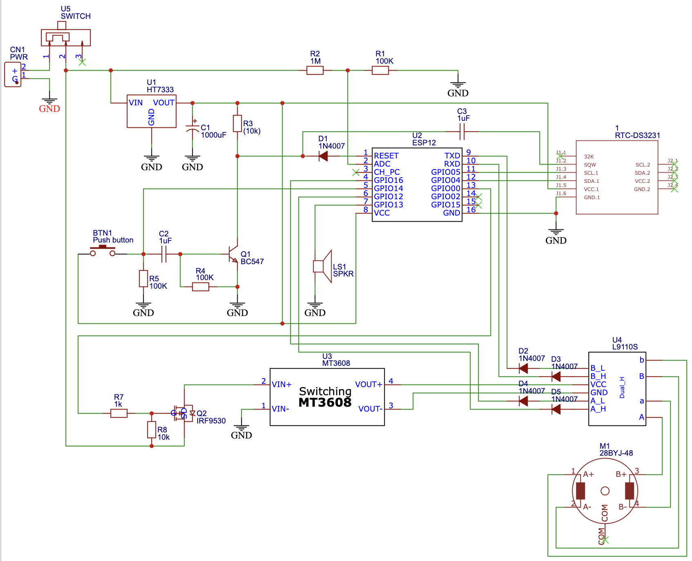

# Chicken Gate

This repository contains circuit diagram and code for low power chicken door using
ESP-8266 (ESP-12) microcontroller, DS3231 RTC module and 28BYJ-48 stepper motor.

## Description

Purpose of this project is to create a chicken door that will automatically open in the
given time in the morning and close in the given time in the evening.

Besides this automatic procedures, manual operation is also allowed using external button
to open or close gate whenever needed.

Configuration and time setting is possible via long pressing the external button - that
will start a WiFi access point with captive portal, so once user connects to the
`chicken-gate` WiFi, he is redirected to the settings page, where it is possible to
synchronize time or set a different timer for opening/closing the gate.

## Circuit Diagram

## Compilation and Upload Configuration

* Board: Generic ESP8266 Module
* Upload speed: 115200
* Flash size: 4M (1M SPIFFS)

## Adjustments To Minimize Power Consumption

### RTC Module

DS3231 is a great real time clock chip, but the standard module drains too much power for
use in low power device running on battery. Fortunately it is possible to lower the power
consumption to just a few micro amps when making a few small adjustments described in
[this video](https://youtu.be/rG50U6bQhYo)

### ESP Microcontroller and Circuit

I was able to lower the power consumption of ESP-8266 board by using the deep sleep mode.
The board is woken up by an RTC module or by an external signal, so no circuit is in place
(GPIO16 connection to RST pin) for ESP to be able to wake up itself.

Current draw of the board and supplemental circuit in the deep sleep mode is about 27 uA
(~0.03 mA) and approximately 700 mA when opening/closing the gate (while stepper motor
is responsible for most of it). One operation cycle (closing, opening) takes in my case
34 seconds.

It means that in theory two operation cycles per day will drain 13.3 mAh while sleeping for
the rest of the day will drain additional 0.72 mAh. One standard day will therefore need
around 14 mAh.

It means that one 18650 battery with capacity of 1800 mAh should power the device for around
128 days, i.e. over 4 months.

## Adjustments To Improve Stepper Motor Torque

Standard 28BYJ-48 stepper motor is working in a unipolar mode. It is possible to increase
the motor torque using the bipolar mode, but it is necessary to adjust the motor in a way
described for instance in [this guide](http://www.jangeox.be/2013/10/change-unipolar-28byj-48-to-bipolar.html).

I followed these instructions and adjusted the stepper motor to increase its power to lift
up the gate.

## The Finished Product

To see the video of working device, check out the [video on YouTube](https://youtu.be/cAucfu40Rm4).
